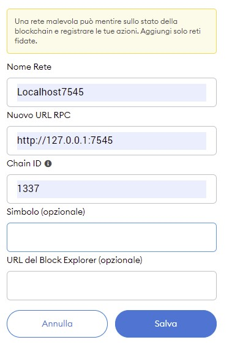

#  Event Ticketing 

## Overview
<a></a>
Project realized for the course "Software Cybersecurity" at Università politecnica delle Marche.

This project create a ticket office application for events using blockchain technology.

## 📦 Environment
This project is tested on OS windows 10 and browser Google Chrome.

## 👩‍💻 Installation
1. Clone the repository
    ```sh
    git clone https://github.com/MassimoCiaffoni/Software-Cybersecurity-Project
    ```

### 🔧 Setting up the blockchain
1. Download and install ganache at official web site: [trufflesuite.com/ganache](https://www.trufflesuite.com/ganache)
2. Execute ganache and create a new blockchain as below screenshot 
   
   <a></a>
3. Go under "Workspace" section and click "Add project" to add configuration in "truffle-config.js" file under root directory of this repository.
   
    <a></a>

4. Select "Accounts & keys" section and paste this string:
    ```
    today rifle dish twin sight endless tube prepare tribe detect accident blur
    ```
    inside the mnemonic field and finally save the workspace. 

   <a></a>


To manage a user accounts and login, we use a browser plugin [Metamask](https://metamask.io/).   
1. To install it, with google chrome browser go to: [metamask.io/download](https://metamask.io/download) and click "Install MetaMask for Chrome"
2. Click on the extension, it will open a new page with this screen and click here to import account from ganache
   
    <a></a>
3. In the "Secret Recovery Phrase" paste the previus string used to generate account on ganace, and choose a password to login into metamask.
   
    <a></a>
4. Now we have to configure the network that we use to connect metamask and ganache. On the extension, click on the network icon and select "Custom RPC".

    <a></a>
5. Compile the fields as below and then save it
   
   <a></a>
6. Now we are connected. For use more account, we have to import it manually.
   So, go on ganache under "Account" section and click the right key button on the second account. It will open a dialog with the private key. We have to copy it.

    <a></a>

    <a></a>
7. Now go on metamask and click "Import account". 
   
   <a></a>
8. Then paste the private key and import it
   
   <a></a>
9. Repeat from the 6 step to import more account. For our purpose, we need at least 3 user. 
   
To compile contracts and manage the blockchain, we use the [Truffle suite](https://www.trufflesuite.com/).
1. To install it run  
   
    ```sh
    npm install -g truffle
    ```
    (if you don't have npm, download and install it from [nodejs.org/it/download](https://nodejs.org/it/download/) )

### 🔧 Setting up the client
The client is a web-app with react and Node.js.
To launch it, we have to do the following steps:
1. Compile the Solidity contract, with this command on the root directory
    ```sh
    truffle migrate
    ```
2. Now change directory and go under /client folder.
3. We have to install the dependencies used into project. So run the command:
    ```sh
    npm install --no-audit
    ```
4. Now we can finally execute the web-app. Now run this command to start the server. It will open a new tab on the browser with the app!
    ```sh
    npm run start-all
    ```
5. Now we need to connect our metamask accounts to the WebApp. For this purpose go to the three dot options and select connect to site

    <a></a>
    
    Metamask will ask which accounts we want to connect; select all imported accounts
   
    <a></a>
6. Now we are connected to the WebApp and ready to test all his functionalities.
## 💻 Usage
For usage guide, see the detailed [report](relazione/Blockchain-ticketing.pdf) from page 101.


## ✍️ Author
#### [Massimo Ciaffoni](mailto:s1102853@studenti.univpm.it) (Matricola 1102853) 
#### [Denil Nicolosi](mailto:s1100331@studenti.univpm.it) (Matricola 1100331)
#### [Michele Pasqualini](mailto:s1101226@studenti.univpm.it) (Matricola 1101226) 
#### [Francesco Zerbino Di Bernardo](mailto:s1102495@studenti.univpm.it) (Matricola 1102495) 


## 🔒 License
Apache License 2.0
